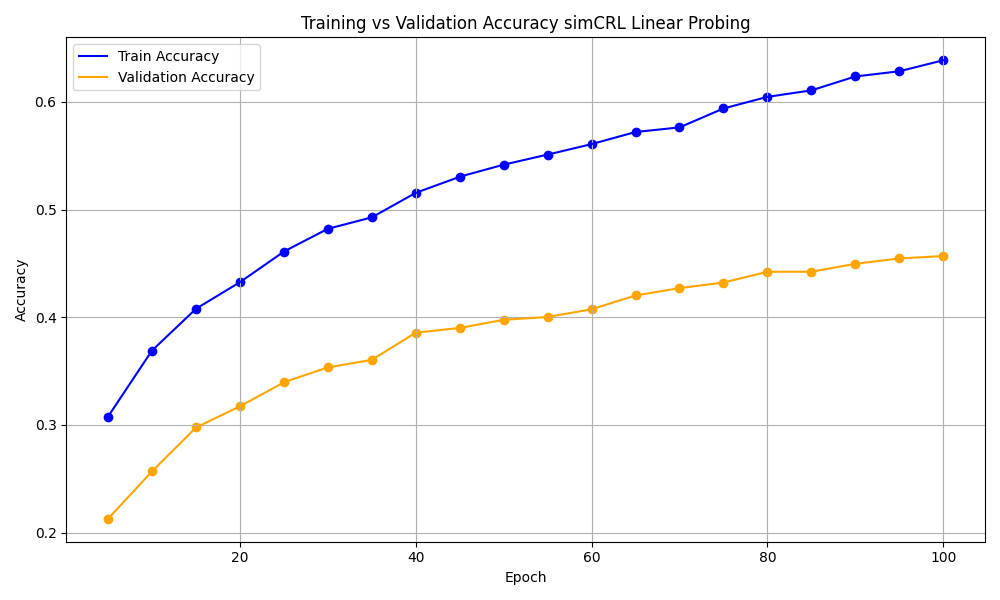
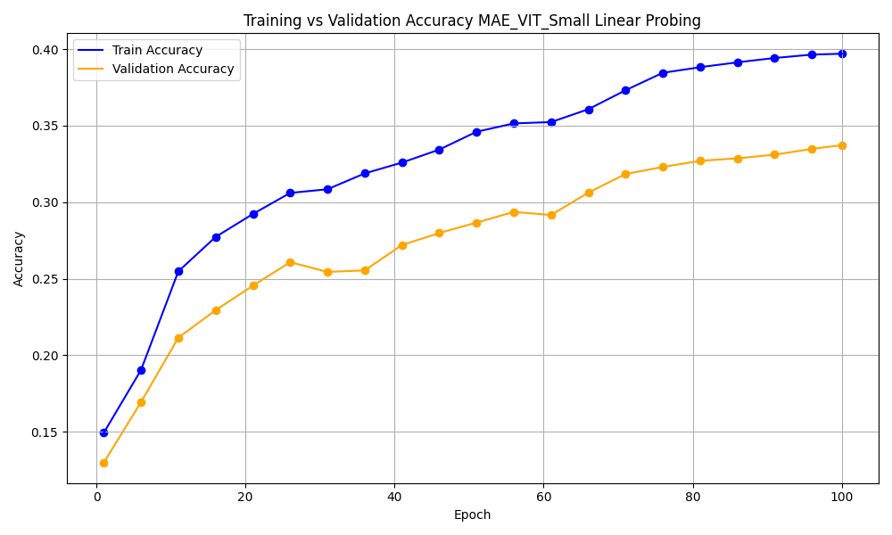
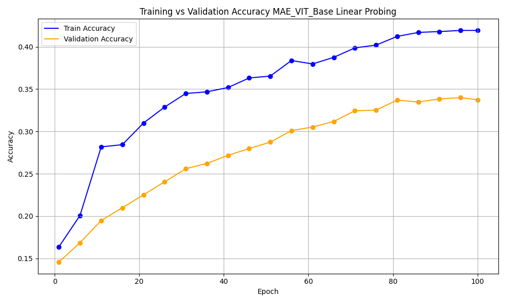

# Self-Supervised Representation Learning: A Comparative Study of MAE and SimCLR

This repository contains the code and analysis for the AIMS-DTU research intern project by **Shivansh Pachnanda**, which compares two prominent self-supervised learning methods for visual representation learning: **Masked Autoencoders (MAE)** and **SimCLR**.

## 📘 Overview

Self-supervised learning (SSL) has become a powerful alternative to supervised methods for learning from large amounts of unlabeled visual data. This project compares **MAE** and **SimCLR** under controlled settings, focusing on:

- Learning representations without labels
- Evaluation using **linear probing**
- Trade-offs in **efficiency**, **accuracy**, and **architecture design**

## 📄 Report Summary

- **MAE**: Uses a Masked Image Modeling (MIM) approach with Vision Transformers (ViT). It reconstructs masked patches of input images to learn semantic representations.
- **SimCLR**: Uses a contrastive learning approach with a ResNet backbone. It brings augmented views of the same image closer in the embedding space while separating different images.

## 🧪 Methodology

### Dataset

- Subset of **ImageNet-100**: 25 classes used for training, 100 for evaluation.
- Data augmentations were applied specific to each method.

### Pretraining Setup

- **SimCLR**:
  - Encoder: ResNet-50
  - Batch size: 256
  - Large batch sizes required for effective contrastive learning

- **MAE**:
  - Encoder: ViT-Small & ViT-Base
  - Batch size: 512
  - Masked patch reconstruction using encoder-decoder structure

### Evaluation: Linear Probing

- Pretrained models are frozen
- A simple linear classifier is trained on top of extracted features
- Assesses representation quality without fine-tuning

## 📈 Graphs & Results

Below are the linear probing performance graphs for each model, plotted over 100 epochs.

### 🔹 SimCLR (ResNet-50)

### 🔹 MAE ViT-Small

### 🔹 MAE ViT-Base

### Model Comparison

| Model        | Architecture        | Parameters | Train Time/Epoch | Train Acc. | Val Acc. |
|--------------|---------------------|------------|------------------|------------|----------|
| MAE ViT-Small| Vision Transformer  | 21.7M      | ~3 min           | 39.7%      | 33.7%    |
| MAE ViT-Base | Vision Transformer  | 86.6M      | ~4.5 min         | 41.9%      | 34.0%    |
| SimCLR       | ResNet-50           | 23.5M      | ~12 min          | 63.9%      | 45.7%    |

> 🔍 SimCLR significantly outperforms MAE in linear probing, but MAE is more efficient and scales better with fine-tuning.

## 📌 Key Observations

- **SimCLR** is better for linear probing tasks due to contrastive learning’s emphasis on separability.
- **MAE** benefits more from full fine-tuning, as linear probing underestimates its potential.
- **Dataset scale** heavily influences SSL effectiveness—larger datasets yield better representations.
- **Efficiency vs. accuracy** trade-offs must be considered when choosing an SSL method.

## 🚧 Limitations

- Limited compute budget (~60 GPU hours) constrained deeper experimentation and hyperparameter tuning.
- Evaluation focused only on linear probing, not fine-tuning or transfer learning.
- Limited experience of author in this niche

## 📁 Project Structure

The project structure is as follows:

- **`final_evaluation_notebooks/`** – Notebooks containing full model definitions and final evaluations  
- **`graphs/`** – Contains training and evaluation graphs (loss, accuracy, etc.)  
- **`logs/`** – Logs for training runs, checkpoints, and performance metrics  
- **`notebooks/`** – Core code for pretraining, feature extraction, and linear probing  
- **`AIMS_DTU_Shivansh_Pachnanda_Report.pdf`** – Detailed project report  
- **`README.md`** – Project documentation (this file)  

### 🔍 Folder Descriptions

- **`final_evaluation_notebooks/`**: Contains detailed model notebooks for **SimCLR**, **MAE ViT-Small**, and **MAE ViT-Base**. Each notebook includes architecture definitions, evaluation logic, and final results.

- **`notebooks/`**: Houses all core logic for:
  - Self-supervised **pretraining**
  - **Feature extraction** using pretrained Self-supervised models
  - **Linear probing** on the ImageNet-100 subset

- **`logs/`**: Includes training logs, epoch-wise metrics, and system-level performance data.

- **`graphs/`**: Visualizations of probing performance across multiple pretraining epochs(loss, accuracy, etc.).

- **`AIMS_DTU_Shivansh_Pachnanda_Report.pdf`**: Complete written report covering the project’s background, methodology, experiments, and findings.

- **`README.md`**: You are here

> 🛠 **Note**: All code was originally developed in private Kaggle notebooks. I’m open to making them public upon request.

## 💻 CODE

All models used in this project are open-sourced on Kaggle under the dataset:

📦 **[SSL Models on Kaggle](https://www.kaggle.com/datasets/harishchanderprivate/ssl-models)**

This includes:
- Pretrained model weights checkpoints
- Linear probing checkpoints

## 🔗 Resources

- 📄 [Project Report (PDF)](./AIMS_DTU_Shivansh_Pachnanda_Report.pdf)
- 📚 MAE: https://github.com/facebookresearch/mae  
- 📚 SimCLR: https://github.com/sthalles/SimCLR

## 🧠 Author

**Shivansh Pachnanda**  

---

> For any questions or suggestions, feel free to open an issue or contact via GitHub.
